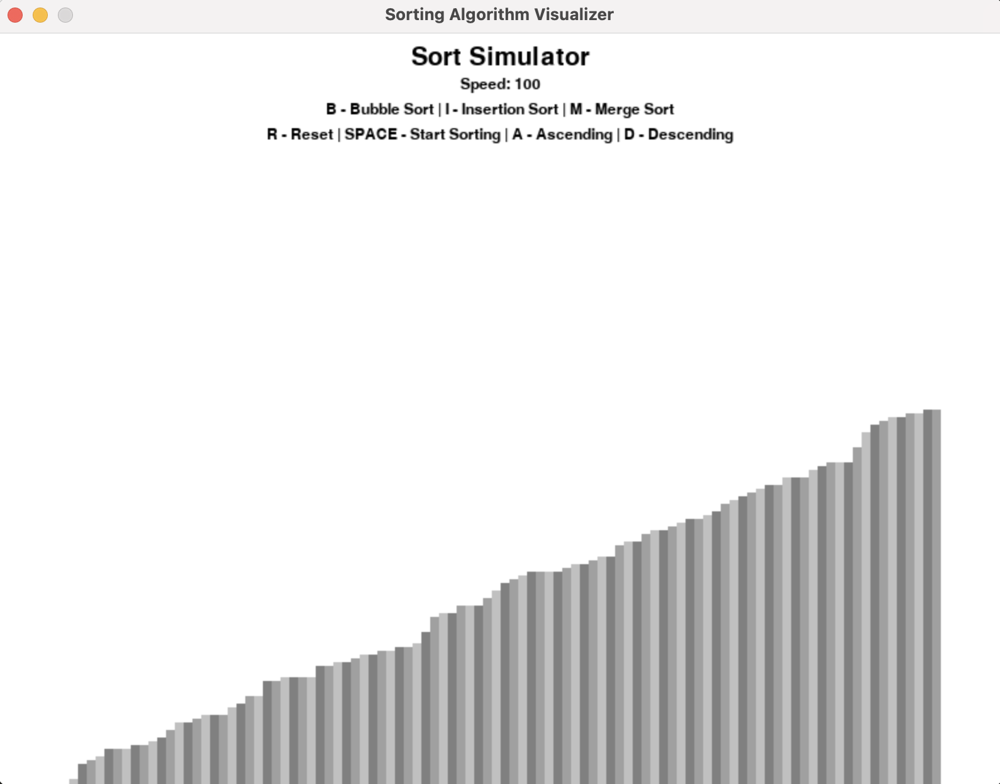

# Python Sorting Simulator

This program randomly generates an array of values and represents it as a series of bars.

The user can select different sorting algorithms to sort the array, randomize/reset the array, and change the speed in which the sort is visualized.

### Tools used
Python
- Pygame: used to visualize the arrays/sorting algorithms
- Random: to randomly generate the array

### Project Feature List

- [ ] Color Highlights for current elements
- [ ] Text Indication of current sorting algorithm
- [X] Insertion Sort Logic
- [X] Merge Sort Logic
- [X] Bubble Sort Logic